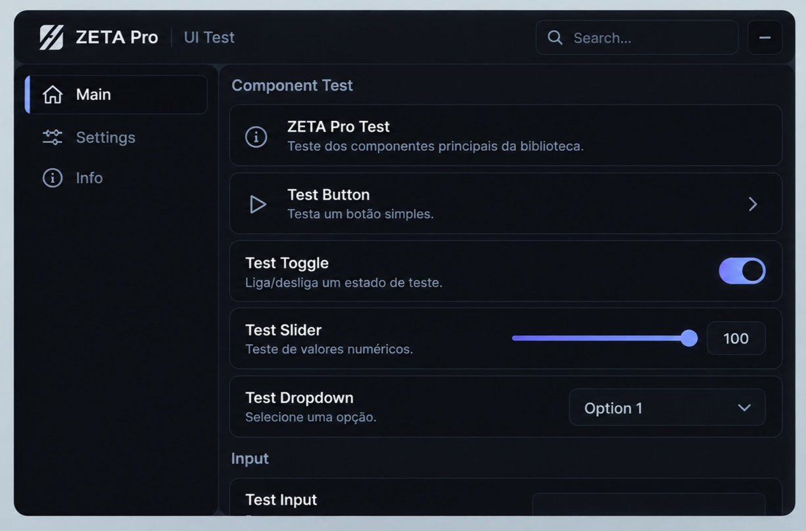

<div align="center">



**A dark, modular UI library for Roblox executors.**


</div>

---

## Features

- Window with drag, resize, minimize/restore and global search
- Tabs, sections and a compact sidebar on smaller windows
- Button, Toggle, Slider, Dropdown, MultiDropdown, Input, Keybind, Colorpicker, Label, Divider
- Theme engine with hot swap — Dark, Light, Midnight, Zeta, and custom themes
- Icon families (Lucide, Solar, Geist, Craft, SF Symbols) via Footagesus/Icons
- Notifications with stacking, progress bar and manual close
- Acrylic effect with graceful fallback
- Config export, import and reset `writefile`
- Full cleanup on `Window:Destroy()`

## Installation

```lua
local Zeta = loadstring(game:HttpGet(
    "https://raw.githubusercontent.com/realkalii/ZetaPro/main/src/init.luau"
))()
```

## Usage
[Docs](https://realkalii.github.io/ZetaPro-docs)

## Icons
Icon families include:
- Lucide
- Solar
- Geist
- Craft
- SF Symbols

```lua
Icon = "home"
Icon = "lucide:settings"
Icon = "solar:bomb"
Icon = "geist:code"
```

`Icon = "home"` keeps using the built-in local set. For `family:name`, the real icons of that family are downloaded once and cached in `ZetaPro/icons/`. If a family cannot be loaded, ZetaPro falls back to its built-in local icons, so the UI never breaks. Solar names carry a variant (`-linear`, `-outline`, `-bold`, `-broken`, `-line-duotone`, `-bold-duotone`); `solar:bomb` picks the first one available, in that order.

The icon sets themselves belong to their authors and keep their own licenses: [Lucide](https://github.com/lucide-icons/lucide), [Craft](https://www.figma.com/community/file/1415718327120418204), [Geist](https://vercel.com/geist/icons), [Solar](https://icones.js.org/collection/solar) and [SF Symbols](https://sf-symbols-one.vercel.app/).

## Credits

- [dawid-scripts/Fluent](https://github.com/dawid-scripts/Fluent) — UX, component set and API shape inspiration
- [Footagesus/Icons](https://github.com/Footagesus/Icons) — icon families (Lucide, Solar, Geist, Craft, SF Symbols)
- [Lucide](https://lucide.dev) / [Feather](https://feathericons.com) — icon style inspiration

