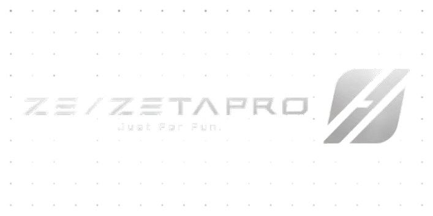

<div align="center">
  

# ZΞTA Pro

<p><b> A modern UI library for Roblox Script Hubs.</b></p>

</div>
---

## Installation

### Stable

The `main` branch contains the latest stable version of ZetaPro.

```lua
loadstring(game:HttpGet("https://raw.githubusercontent.com/realkalii/ZetaPro/main/src/init.luau"))()
```

### Beta

The `beta` branch contains the latest version currently being tested.

```lua
loadstring(game:HttpGet("https://raw.githubusercontent.com/realkalii/ZetaPro/beta/src/init.luau"))()
```

> [!WARNING]
> Beta versions may contain bugs or unfinished features and are mainly intended for testing.

### Specific version

You can use a specific release through its GitHub tag.

```lua
loadstring(game:HttpGet("https://raw.githubusercontent.com/realkalii/ZetaPro/v1.0.1/src/init.luau"))()
```

This keeps your script on that version until you manually change the tag.

---

## Links

- For the full API, examples and guides, see the [documentation](https://github.com/realkalii/ZetaPro/tree/main/docs).

- Join our [discord community](https://discord.gg/9EPXws3Ybg)

---

## Credits

| Project | Contribution |
| --- | --- |
| [dawid-scripts/Fluent](https://github.com/dawid-scripts/Fluent) | UX, components and API inspiration |
| [Icons.rest](https://icons.rest) | Source for icons |
